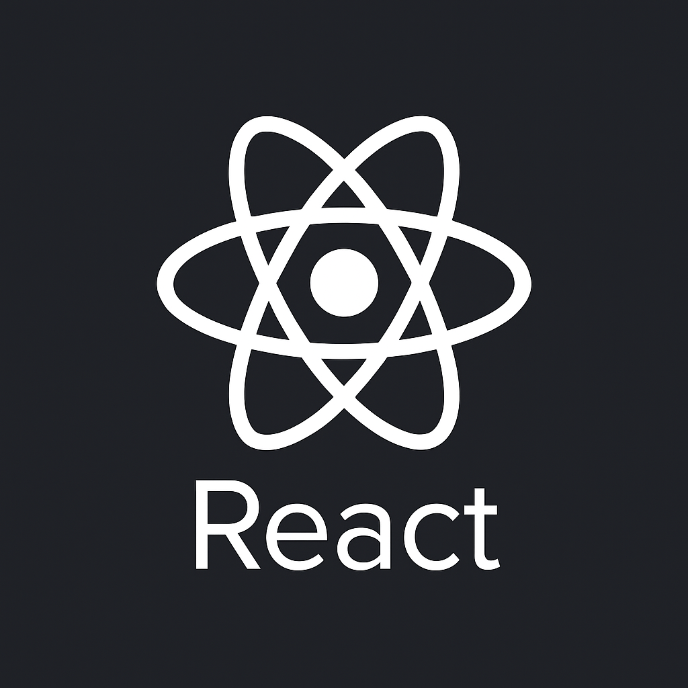
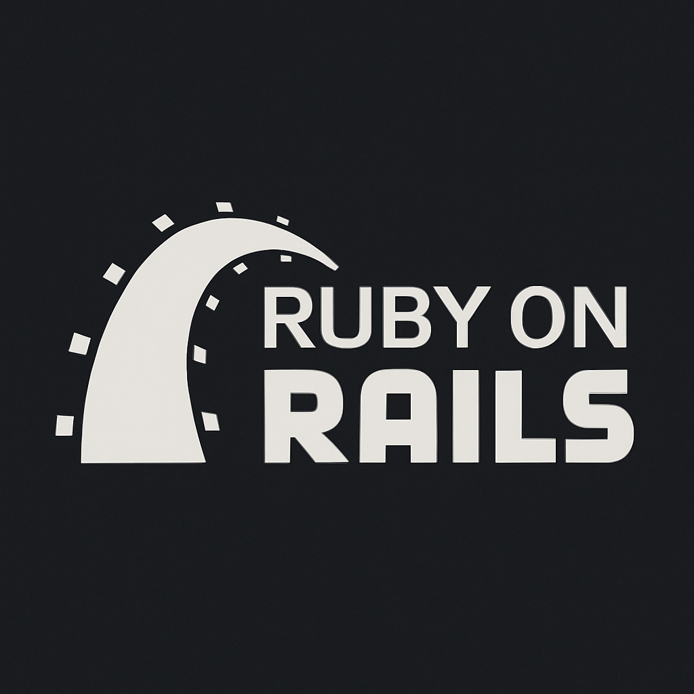
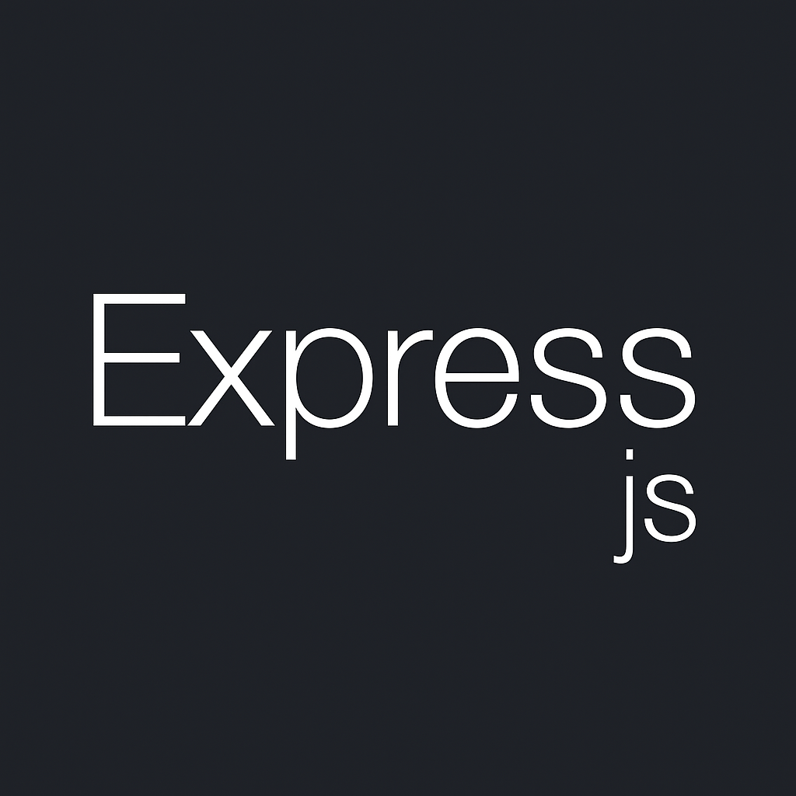

## Olá ! Eu sou Rodrigo César - Desenvolvedor Fullstack 🖐️

<<<<<<< HEAD
Engenheiro de software especializado em desenvolver aplicações web modernas.

Atualmente, faço parte de uma equipe multidisciplinar que adota a metodologia **Scrum**, onde meu foco principal tem sido o desenvolvimento e a manutenção de aplicações front-end utilizando **TypeScript**, **Angular** e **React**, **HTML**, **CSS** e **CSS-in-JS** , além da implementação de testes unitários com **Jest** e **React Testing Library** para garantir a qualidade do código. Esses projetos têm como objetivo automatizar processos e aumentar a produtividade. Neles, contribuí com soluções que geraram impactos reais, como a redução de até 75% dos colaboradores envolvidos em determinados fluxos, por meio de sistemas mais eficientes e orientados à entrega de valor.

Com mais de uma década de experiência em desenvolvimento web, tive a oportunidade de contribuir para mais de 200 projetos de sites, atuando como desenvolvedor front-end, além de também atuar como desenvolvedor full-stack, participando ativamente de todas as fases do ciclo de desenvolvimento — desde a concepção até a entrega final.

Minha stack principal nos últimos anos tem sido **React** e **TypeScript**, porém, ao longo da minha jornada, tive a oportunidade de trabalhar com outras tecnologias, como **PHP** (Laravel e CodeIgniter), **Node.js** e **WordPress** como CMS. Contudo, não me prendo a ferramentas específicas e estou sempre aberto a aprender novas tecnologias, pois acredito que a tecnologia deve servir ao negócio — e não o contrário.

Atualmente, tenho aprofundado cada vez mais minha atuação com **Ruby on Rails**, explorando o melhor do ecossistema — **de Active Record** a **Hotwire**, **RSpec**, **Devise**, **Pundit** e **Sidekiq**. A linguagem e o framework se alinham profundamente à minha forma de pensar soluções elegantes, produtivas e sustentáveis ao longo do tempo.

Além das habilidades técnicas, destaco minha capacidade de trabalhar em equipe e de comunicar-me de forma clara e eficaz. Essas competências são essenciais para colaborar com colegas e stakeholders, tornando meu trabalho mais produtivo e alinhado aos objetivos do negócio.
=======
Sou engenheiro de software com atuação predominante no front-end, mas com vivência em projetos full-stack ao longo da carreira.

Com mais de 10 anos de experiência em desenvolvimento web, atuei principalmente como front-end, contribuindo para mais de 200 projetos de sites nos últimos anos. Em várias ocasiões, assumi a função de desenvolvedor full-stack, participando ativamente de todas as fases do ciclo de desenvolvimento, desde a concepção até a entrega final.

Atualmente, faço parte de uma equipe multidisciplinar que adota a metodologia **Scrum**, onde meu foco principal tem sido o desenvolvimento e a manutenção de aplicações front-end utilizando **TypeScript**, **Angular** e **React**, além da implementação de testes unitários com **Jest** e **React Testing Library** para garantir a qualidade do código. Esses projetos têm como objetivo automatizar processos e aumentar a produtividade. Neles, contribuí com soluções que geraram impactos reais, como a redução de até 75% dos colaboradores envolvidos em determinados fluxos, por meio de sistemas mais eficientes e orientados à entrega de valor.

Minha stack principal nos últimos anos tem sido **React** e **TypeScript**, porém, ao longo da minha jornada, tive a oportunidade de trabalhar com outras tecnologias, como **PHP** (Laravel e CodeIgniter), **Node.js** e **WordPress** como CMS. Contudo, não me prendo a ferramentas específicas e estou sempre aberto a aprender novas tecnologias, pois acredito que a tecnologia deve servir ao negócio — e não o contrário.

Recentemente, tenho me aprofundado em **Ruby on Rails**, explorando o melhor do ecossistema Rails — de **Active Record** a **Hotwire**, **RSpec**, **Devise**, **Pundit** e **Sidekiq**.

Além das habilidades técnicas, destaco minha capacidade de trabalhar em equipe e de comunicar-me de forma clara e eficaz. Essas competências são essenciais para colaborar com colegas e stakeholders, tornando meu trabalho mais produtivo e alinhado aos objetivos do negócio.

Minha dedicação à excelência e minha habilidade em resolver problemas são fundamentais para garantir a alta qualidade do meu trabalho e superar desafios técnicos com sucesso.
>>>>>>> fbcd037e2481d6608f002fea7e9e76f65c671497

**Habilidades Técnicas:**

- React
- Ruby on Rails
- TypeScript
- JavaScript
- HTML/CSS
- CSS-In-JS (Styled Components)
- Jest
- React Testing Library
- Git/Github
- Angular
- Node (Express)
- Figma
- PHP e Laravel
- Python e Django
- CI/CD com Jenkins e Azure
- MySQL

**Outras Habilidades:**

- Habilidades de comunicação clara e concisa.
- Atitude independente e proativa na resolução de problemas.
- Experiência em trabalho remoto em equipes que utilizam práticas ágeis.
- Gosto por criar código bem projetado, testável e eficiente.
<<<<<<< HEAD
=======

## Projetos Destaques

Na visão geral abaixo você encontrará minha experiência de trabalho mais recente:

**Imovyx** \
Aplicação React focada na gestão imobiliária,\
Linguagens & Tecnologias: `React`, `Typescript`, `Next.js`, `Tailwind`, `React Query`,\
[Imovyx](https://github.com/rodrigocnn/imovyx)
 

**Imovyx - Backend Rails** \
API para Gestão de Aluguel de Imóveis desenvolvida com Ruby on Rails,\
Linguagens & Tecnologias: `Ruby on Rails`, `RSpec`, `PostgreSQL`,\
[Imovyx - backend](https://github.com/rodrigocnn/gestor-imob)

**Medease** \
Aplicação React focada Gestão para Clínicas de Saúde ,\
Linguagens & Tecnologias: `React`, `Typescript`, `Next.js`, `Tailwind`, `React Query`,\
[Medease](https://github.com/rodrigocnn/medease)
 

**Medease- Backend Node** \
API para Gestão para Clínicas de Saúde desenvolvida com Express.js,\
Linguagens & Tecnologias: `Express`, `Typescript`, `MYSQL`, `BCrypt`, `Prisma`,\
[Medease - backend](https://github.com/rodrigocnn/medease-node)

 

 

>>>>>>> fbcd037e2481d6608f002fea7e9e76f65c671497
